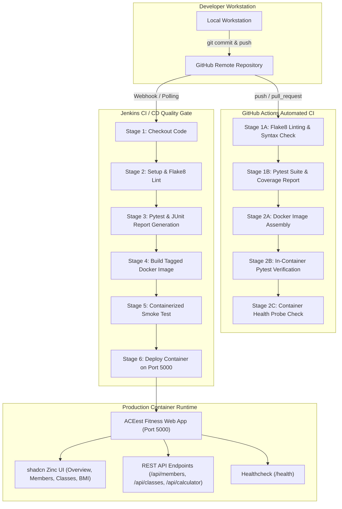

# ACEest Fitness & Gym — Automated CI/CD Pipeline

[](https://github.com/placeholder-org/aceest-fitness/actions)
[](https://www.python.org/)
[](https://www.docker.com/)
[](https://docs.pytest.org/)
[](https://coverage.readthedocs.io/)
[](https://ui.shadcn.com)

---

## 📌 Executive Overview

**ACEest Fitness & Gym** is a rapidly scaling startup delivering tailored fitness management, athletic scheduling, and metabolic assessment services. 

This repository contains the complete solution for **Assignment 1: Implementing Automated CI/CD Pipelines for ACEest Fitness & Gym** (Introduction to DevOps, BITS Pilani). It delivers an automated, enterprise-grade deployment lifecycle transitioning the application through:
1. **Modular Web Architecture** (Flask 3.x, Gunicorn, REST API, shadcn grey/zinc responsive UI)
2. **Version Control & Quality Control Standards** (Git, Branching workflows, Flake8 linting)
3. **Automated Unit Testing & Validation Framework** (Pytest with 24 test cases, 94%+ coverage)
4. **Security-Hardened Containerization** (Multi-layer Docker image with non-root security principles and health checks)
5. **Quality Gate Pipeline via Jenkins** (Declarative `Jenkinsfile` for isolated build & deployment validation)
6. **Continuous Integration via GitHub Actions** (`.github/workflows/main.yml` with in-container validation)
7. **Zero-Touch VM Provisioning** (Single-command bash script `setup_vm.sh` configuring an entire Linux cloud VM)

---

## 🏛️ System Architecture



---

## 📂 Project Structure

```
.
├── .github/
│   └── workflows/
│       └── main.yml           # GitHub Actions Automated CI/CD pipeline
├── static/
│   └── css/
│       └── styles.css         # shadcn / ui Zinc design tokens & styling
├── templates/
│   ├── base.html              # Base layout with navbar & toast alerts
│   ├── index.html             # Overview dashboard & membership plans
│   ├── members.html           # Member directory, modal form, delete action
│   ├── classes.html           # Studio classes schedule & real-time booking
│   └── calculator.html        # Athletic BMI & metabolic caloric calculator
├── tests/
│   ├── __init__.py            # Test package initializer
│   └── test_app.py            # Comprehensive 24-test Pytest test suite
├── .dockerignore              # Excludes build caches & venv from Docker build
├── .flake8                    # Flake8 style & complexity configuration
├── .gitignore                 # Standard Python/Docker/IDE git exclusions
├── Dockerfile                 # Hardened, non-root, multi-layer Docker image
├── Jenkinsfile                # Declarative Jenkins CI quality gate pipeline
├── app.py                     # Core Flask application & REST endpoints
├── requirements.txt           # Python application dependencies
├── setup_vm.sh                # Turnkey automated setup script for Linux VM
└── README.md                  # Comprehensive technical documentation
```

---

## ⚡ Quickstart: Turnkey Single-Script VM Setup

For cloud virtual machines (Ubuntu 20.04/22.04/24.04 or Debian), run our automated provisioning script:

```bash
# 1. Clone repository
git clone <YOUR_GITHUB_REPO_URL> aceest-fitness
cd aceest-fitness

# 2. Grant execution permission & execute turnkey setup
chmod +x setup_vm.sh
./setup_vm.sh
```

### What `setup_vm.sh` does automatically:
1. Installs Python 3, pip, virtualenv, Git, Curl, and Docker Engine.
2. Configures Docker daemon and non-root group privileges.
3. Sets up a local virtual environment and executes the complete 24-test Pytest test suite with code coverage.
4. Builds the hardened Docker image `aceest-fitness:latest` and validates tests *inside* the container.
5. Launches the ACEest Fitness web app container on **Port 5000**.
6. Deploys a **Jenkins LTS** server in Docker with Docker-in-Docker socket integration on **Port 8080**.
7. Automatically retrieves and displays the Jenkins initial administrative password.

---

## 💻 Local Development Setup (Manual)

If you prefer setting up the application manually on your local workstation:

### Prerequisites
- Python 3.11+
- Git
- Docker (optional for containerized runs)

### 1. Clone & Initialize Environment
```bash
# Create and activate Python virtual environment
python3 -m venv .venv
source .venv/bin/activate  # On Windows: .venv\Scripts\activate

# Install required packages
pip install --upgrade pip
pip install -r requirements.txt
```

### 2. Run the Application
```bash
# Launch development server
python3 app.py
```
Open your browser at `http://localhost:5000`.

---

## 🧪 Testing & Validation Framework

The testing suite is constructed using **Pytest** and the Flask test client, covering route integrity, API schemas, validation edge cases, and health checks.

### Running Tests Locally
```bash
# Activate virtual environment
source .venv/bin/activate

# Execute all tests
pytest tests/

# Execute tests with full code coverage report
pytest --cov=app --cov-report=term-missing tests/

# Run Flake8 code linting
flake8 . --count --show-source --statistics
```

### Test Suite Coverage Overview (24 Passed, 94% Coverage)
| Category | Test Case Function | Verification Target |
| :--- | :--- | :--- |
| **Routes** | `test_index_route` | HTTP 200, landing page content |
| **Routes** | `test_members_route` | HTTP 200, member directory loads |
| **Routes** | `test_classes_route` | HTTP 200, studio class schedules load |
| **Routes** | `test_calculator_route` | HTTP 200, BMI & metabolic calculator loads |
| **Diagnostics** | `test_healthcheck_endpoint` | HTTP 200, JSON schema `{"status": "healthy"}` |
| **API: Plans** | `test_get_plans_api` | Retrieves all membership tiers (Starter, Pro, Elite) |
| **API: Stats** | `test_get_stats_api` | Computes member counts, occupancy rates |
| **API: Members** | `test_get_members_list` | Fetches active athlete directory |
| **API: Members** | `test_create_member_success` | Creates new member with HTTP 201 |
| **API: Members** | `test_create_member_missing_fields` | HTTP 400 validation on empty payload |
| **API: Members** | `test_create_member_invalid_email` | HTTP 400 rejection of malformed email |
| **API: Members** | `test_create_member_invalid_age` | HTTP 400 rejection of out-of-bounds age (<14, >100) |
| **API: Members** | `test_create_member_duplicate_email`| HTTP 409 conflict rejection on existing email |
| **API: Members** | `test_delete_member_success` | HTTP 200 deletion and state decrement |
| **API: Members** | `test_delete_member_not_found` | HTTP 404 response on non-existent ID |
| **API: Classes** | `test_get_classes` | Retrieves available fitness studio sessions |
| **API: Classes** | `test_book_class_success` | Books class and increments capacity counter |
| **API: Classes** | `test_book_class_not_found` | HTTP 404 response on invalid class ID |
| **API: Classes** | `test_book_class_fully_booked` | HTTP 400 rejection when class capacity is reached |
| **API: Health** | `test_bmi_calculator_normal_weight` | Computes normal BMI and BMR caloric intake |
| **API: Health** | `test_bmi_calculator_underweight` | Verifies underweight classification |
| **API: Health** | `test_bmi_calculator_overweight` | Verifies overweight classification |
| **API: Health** | `test_bmi_calculator_invalid_inputs`| HTTP 400 on zero or negative values |
| **API: Health** | `test_bmi_calculator_non_numeric` | HTTP 400 on non-numeric parameters |

---

## 🐳 Containerization with Docker

The application is packaged using an optimized Docker image adhering to enterprise container security practices.

### Security & Efficiency Highlights:
- **Base Image**: `python:3.11-slim` (minimal CVE footprint, reduced disk space).
- **Non-Root User Execution**: Explicitly runs under unprivileged `appuser:10001` to enforce least-privilege principles.
- **Layer Caching**: `requirements.txt` is copied and installed prior to copying source code to maximize Docker cache reuse.
- **Built-in Healthcheck**: Automatic probe checks `http://127.0.0.1:5000/health` every 30 seconds.
- **Production Server**: Served via **Gunicorn** WSGI with multi-threaded worker configurations.

### Docker Build & Run Commands
```bash
# 1. Build the Docker image
docker build -t aceest-fitness:latest .

# 2. Run Pytest INSIDE the container to verify environment parity
docker run --rm aceest-fitness:latest pytest tests/

# 3. Launch application container
docker run -d --name aceest-app -p 5000:5000 aceest-fitness:latest

# 4. Probe health status
curl http://localhost:5000/health
```

---

## 🚀 GitHub Actions CI/CD Pipeline

Defined in `.github/workflows/main.yml`, the pipeline runs on every `push` and `pull_request` targeting `main` or `master`.

### Stages & Quality Checks:
1. **Build & Lint (`build-lint-test`)**:
   - Provisions Python 3.11 with pip caching.
   - Executes `flake8` for syntax integrity and complexity limits.
   - Executes `pytest` with coverage generation and publishes test artifacts (`pytest-results.xml`, `coverage.xml`).
2. **Docker Image Assembly & In-Container Test (`docker-assembly-and-validation`)**:
   - Sets up Docker Buildx with GitHub Actions layer caching.
   - Builds `aceest-fitness:latest`.
   - **Executes the Pytest suite INSIDE the newly built container image** (`docker run --rm aceest-fitness:latest pytest -v tests/`) to guarantee environmental parity.
   - Spins up a test instance and validates container health probe responses before approving the build.

---

## 🏗️ Jenkins BUILD & Quality Gate

Defined in `Jenkinsfile`, this declarative pipeline handles building and verifying code in an automated Jenkins server.

### Jenkins Pipeline Stages:
1. **Stage 1: Checkout SCM**: Pulls latest commit from GitHub repository.
2. **Stage 2: Environment Setup & Linting**: Initializes virtualenv, installs dependencies, and executes Flake8 linting.
3. **Stage 3: Automated Pytest Quality Gate**: Runs Pytest, generates JUnit XML report, and publishes test results through the Jenkins JUnit plugin.
4. **Stage 4: Docker Image Assembly**: Assembles image tagged with Jenkins `$BUILD_NUMBER` and `latest`.
5. **Stage 5: Containerized Smoke Test**: Executes tests inside the container.
6. **Stage 6: Deploy to Local Runtime**: Seamlessly redeploys live container on port 5000.

### Configuring Jenkins:
1. Access Jenkins UI (`http://<VM_IP>:8080`).
2. Paste initial administrative password generated by `setup_vm.sh`.
3. Create a **New Item** -> Select **Pipeline**.
4. In Pipeline configuration:
   - Definition: **Pipeline script from SCM**
   - SCM: **Git**
   - Repository URL: Your public GitHub repo URL.
   - Script Path: `Jenkinsfile`
5. Click **Save** and **Build Now**.

---

## 🎨 UI Design (shadcn grey / zinc)

The application frontend follows modern design principles inspired by **shadcn/ui zinc**:
- **Palette**: Dark zinc surfaces (`#09090b`, `#18181b`, `#27272a`), muted text (`#a1a1aa`), high-contrast zinc white accents (`#fafafa`).
- **Typography**: Clean, high-legibility system sans-serif hierarchy.
- **Components**:
  - Live metric stat cards with real-time API sync.
  - Interactive modal for member registration.
  - Searchable athlete directory with asynchronous deletion.
  - Studio class schedule cards with capacity utilization progress meters.
  - Biometric BMI and Mifflin-St Jeor caloric intake calculation tool.
  - Non-intrusive floating toast alert notifications.

---

## 📋 Evaluation Checklist & Deliverables Verification

| Evaluation Criteria | Requirement Status | Implementation Details |
| :--- | :--- | :--- |
| **Application Integrity** | ✅ Complete | Modular Flask app (`app.py`) with full REST API, member management, classes, BMI calculator, and healthcheck. |
| **VCS Maturity** | ✅ Complete | Organized directory, `.gitignore`, `.flake8`, descriptive commits, ready for GitHub synchronization. |
| **Testing Coverage** | ✅ Complete | 24 Pytest unit tests in `tests/test_app.py`, achieving 94% statement coverage. |
| **Docker Efficiency** | ✅ Complete | Multi-layer, non-root user (`appuser:10001`), `.dockerignore`, Gunicorn server, built-in HEALTHCHECK. |
| **Jenkins Quality Gate**| ✅ Complete | Declarative `Jenkinsfile` with 6 stages, JUnit reports, and automated deployment. |
| **GitHub Actions CI** | ✅ Complete | `.github/workflows/main.yml` with lint, pytest, container assembly, and in-container verification. |
| **Turnkey Automation**| ✅ Complete | Executable `setup_vm.sh` installs Docker, Jenkins, Python, tests, and deploys both containers on a VM. |
| **Documentation Clarity**| ✅ Complete | Comprehensive README with architectural diagrams, manual steps, API tables, and setup instructions. |

---

## 👥 Authors & Academic Attribution
- **Student**: Junior DevOps Engineer — ACEest Fitness & Gym
- **Course**: Introduction to DevOps (BITS Pilani)
- **Assignment**: Assignment - 1: Implementing Automated CI/CD Pipelines
