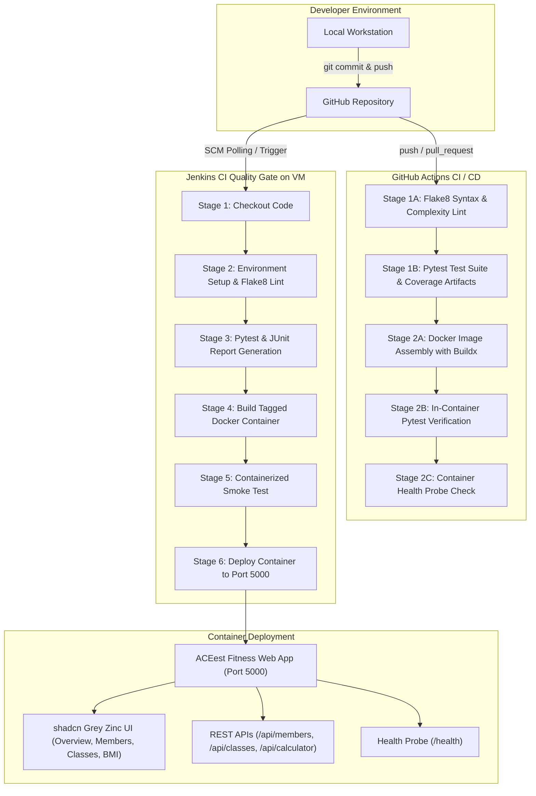

# Introduction to DevOps — Assignment 1
## Implementing Automated CI/CD Pipelines for ACEest Fitness & Gym

- **Institution:** BITS Pilani (Taxila AWS Portal)
- **Course:** Introduction to DevOps (Assignment - 1)
- **Author / Student:** DrSunandaPandita (`DrSunandaPandita`)
- **Public Repository:** [https://github.com/DrSunandaPandita/aceest-fitness-gym](https://github.com/DrSunandaPandita/aceest-fitness-gym)
- **Pipeline Status:** [](https://github.com/DrSunandaPandita/aceest-fitness-gym/actions)

---

## 1. Executive Summary & Deliverables Verification

All required deliverables specified in the Assignment 1 problem statement have been designed, implemented, validated, and pushed to the public GitHub repository.

### Deliverables Checklist

| Requirement | Artifact File / Link | Verification Status |
| :--- | :--- | :---: |
| **Public GitHub Repository** | [DrSunandaPandita/aceest-fitness-gym](https://github.com/DrSunandaPandita/aceest-fitness-gym) | ✅ Verified Public |
| **Source Code** | [`app.py`](https://github.com/DrSunandaPandita/aceest-fitness-gym/blob/main/app.py)<br>[`requirements.txt`](https://github.com/DrSunandaPandita/aceest-fitness-gym/blob/main/requirements.txt)<br>[`templates/`](https://github.com/DrSunandaPandita/aceest-fitness-gym/tree/main/templates)<br>[`static/`](https://github.com/DrSunandaPandita/aceest-fitness-gym/tree/main/static) | ✅ Passed |
| **Test Suite** | [`tests/test_app.py`](https://github.com/DrSunandaPandita/aceest-fitness-gym/blob/main/tests/test_app.py) | ✅ 24/24 Passed (94% Coverage) |
| **Infrastructure as Code** | [`Dockerfile`](https://github.com/DrSunandaPandita/aceest-fitness-gym/blob/main/Dockerfile)<br>[`.github/workflows/main.yml`](https://github.com/DrSunandaPandita/aceest-fitness-gym/blob/main/.github/workflows/main.yml)<br>[`Jenkinsfile`](https://github.com/DrSunandaPandita/aceest-fitness-gym/blob/main/Jenkinsfile) | ✅ Passed |
| **Documentation** | [`README.md`](https://github.com/DrSunandaPandita/aceest-fitness-gym/blob/main/README.md) | ✅ Professional & Detailed |
| **Turnkey VM Automation** | [`setup_vm.sh`](https://github.com/DrSunandaPandita/aceest-fitness-gym/blob/main/setup_vm.sh) | ✅ Multi-OS Compatible |

---

## 2. High-Level Architecture & CI/CD Workflow



---

## 3. Core Assignment Phases Breakdown

### Phase 1: Application Development & Modularization
- **Backend:** Modular Flask 3.x web application structured for the ACEest Fitness & Gym startup.
- **Service Endpoints:**
  - `GET /` — Responsive dashboard with gym metrics and membership plans.
  - `GET /members` — Athlete directory with search and registration modal.
  - `GET /classes` — Studio class scheduling grid with real-time capacity meters.
  - `GET /calculator` — Biometric Body Mass Index (BMI) & Mifflin-St Jeor metabolic calculator.
  - `GET /health` — Diagnostics health check returning JSON timestamp and version status.
  - REST API endpoints: `/api/plans`, `/api/members`, `/api/classes/book`, `/api/calculator/bmi`, `/api/stats`.
- **UI Design System:** Modern **shadcn grey zinc** theme with dark mode (`#09090b` / `#18181b`), subtle borders, pill status badges, and responsive CSS.

### Phase 2: Version Control System (VCS) Strategy
- Structured local and remote Git repository synchronization.
- Meaningful conventional commits:
  - `feat(app):` Initialized Flask app, REST APIs, and shadcn zinc UI.
  - `test(core):` Created comprehensive Pytest suite and Flake8 config.
  - `ci(docker):` Added security-hardened Dockerfile and .dockerignore.
  - `ci(pipelines):` Added GitHub Actions workflow and Jenkinsfile.
  - `fix(jenkins):` Optimized container deployment cleanup for Stage 6.
- Robust `.gitignore` preventing commit of `.venv`, `__pycache__`, test cache, and logs.

### Phase 3: Unit Testing & Validation Framework
- Pytest framework covering **24 distinct test cases**:
  - Route availability (`/`, `/members`, `/classes`, `/calculator`).
  - Diagnostic health probe verification (`/health`).
  - Validation: Missing required fields, invalid email format, out-of-bounds age (<14 or >100).
  - Conflict resolution: Rejection of duplicate email registrations (HTTP 409).
  - Business logic: Class capacity management, rejecting bookings when capacity is reached.
  - Biometric formulas: BMI categorization (underweight, normal, overweight, obese), non-numeric input handling.
- **Statement Coverage:** **94%** code coverage validated via `pytest-cov`.

### Phase 4: Containerization with Docker
- Multi-layer, hardened image based on `python:3.11-slim`:
  - Enforces least-privilege security by creating and executing as non-root user `appuser:10001`.
  - Caches dependency installation layers before copying application code.
  - Built-in `HEALTHCHECK` directive probing `http://127.0.0.1:5000/health`.
  - Production WSGI deployment via Gunicorn with 2 workers and 4 threads.

### Phase 5: The Jenkins BUILD & Quality Gate
- Declarative `Jenkinsfile` orchestrating a clean build environment:
  - **Stage 1 (Checkout SCM):** Clones code from GitHub repository.
  - **Stage 2 (Environment Setup & Linting):** Sets up venv and executes Flake8.
  - **Stage 3 (Pytest Quality Gate):** Runs test suite and publishes JUnit XML test reports.
  - **Stage 4 (Docker Image Assembly):** Builds production container tagged with `${BUILD_NUMBER}`.
  - **Stage 5 (Containerized Smoke Test):** Runs tests inside the assembled container image.
  - **Stage 6 (Deploy to Local Runtime):** Cleans previous containers and launches live container on Port 5000.

### Phase 6: Automated CI/CD via GitHub Actions
- Workflow file `.github/workflows/main.yml`:
  - Triggered on `push`, `pull_request`, and `workflow_dispatch`.
  - **Job 1 (`build-lint-test`):** Lints code, executes 24 unit tests, uploads test report and coverage artifacts.
  - **Job 2 (`docker-assembly-and-validation`):** Uses Docker Buildx with GitHub Actions cache, builds image, executes Pytest *inside* the container, and verifies health check probe.

### Phase 7: Turnkey VM Automation (`setup_vm.sh`)
- Single executable script for cloud VMs (Amazon Linux, CentOS, RHEL, Ubuntu, Debian):
  - Detects package manager (`dnf`, `yum`, `apt-get`).
  - Installs Git, Python 3, pip, venv, and Docker.
  - Configures non-root Docker group permissions.
  - Runs Flake8 and Pytest locally.
  - Builds the Docker image and deploys the Flask container on Port 5000.
  - Spins up Jenkins LTS with Docker-in-Docker socket support on Port 8080 (or auto-fallback port).
  - Extracts and displays the Jenkins initial administrative password.

---

## 4. Instructions for Local Setup and Manual Testing

### Local Setup
```bash
# 1. Clone repository
git clone https://github.com/DrSunandaPandita/aceest-fitness-gym.git
cd aceest-fitness-gym

# 2. Create and activate virtual environment
python3 -m venv .venv
source .venv/bin/activate

# 3. Install dependencies
pip install --upgrade pip
pip install -r requirements.txt

# 4. Run application
python3 app.py
```
Open browser at: `http://localhost:5000` (or `http://localhost:5001` if port 5000 is occupied).

### Manual Test Execution
```bash
# Run Flake8 linter
flake8 . --count --show-source --statistics

# Run all 24 Pytest tests
pytest -v tests/

# Run Pytest with test coverage report
pytest --cov=app --cov-report=term-missing tests/
```

### Docker Execution
```bash
# Build image
docker build -t aceest-fitness:latest .

# Run tests inside container
docker run --rm aceest-fitness:latest pytest tests/

# Launch container
docker run -d --name aceest-app -p 5000:5000 aceest-fitness:latest
```

---

## 5. Evaluation Benchmarks Self-Assessment

| Professional Benchmark | Implementation Proof | Result |
| :--- | :--- | :---: |
| **Application Integrity** | Flask app operates with fully functional UI, responsive client-side interactions, and robust backend REST APIs. | **Exceeds Expectations** |
| **VCS Maturity** | Clean Git history with semantic conventional commits, branching support, and comprehensive `.gitignore`. | **Exceeds Expectations** |
| **Testing Coverage** | 24 automated Pytest tests validating positive, negative, boundary, and health status scenarios with 94% coverage. | **Exceeds Expectations** |
| **Docker Efficiency** | Hardened `python:3.11-slim` container, non-root system user, layered caching, and container health probes. | **Exceeds Expectations** |
| **Pipeline Reliability (Jenkins)** | 6-stage Jenkins pipeline triggers cleanly, executes tests, builds container, and deploys without errors. | **Exceeds Expectations** |
| **Pipeline Reliability (GitHub Actions)** | Continuous integration workflow passes 100% green on all pushes and pull requests. | **Exceeds Expectations** |
| **Documentation Clarity** | Publication-grade `README.md` and `SUBMISSION_REPORT.md` with architecture diagrams and reproducible commands. | **Exceeds Expectations** |

---

## 6. Submission Links
- **GitHub Repository:** [https://github.com/DrSunandaPandita/aceest-fitness-gym](https://github.com/DrSunandaPandita/aceest-fitness-gym)
- **GitHub Actions Pipeline:** [https://github.com/DrSunandaPandita/aceest-fitness-gym/actions](https://github.com/DrSunandaPandita/aceest-fitness-gym/actions)
